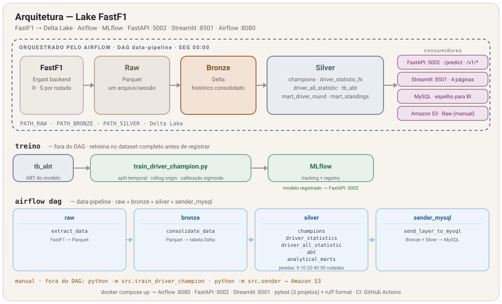

# Lake FastF1

[](https://github.com/rvanguita/lake-fastf1/actions/workflows/tests.yml)


Uma plataforma de dados e machine learning para transformar resultados históricos da Fórmula 1 em datasets confiáveis, análises interativas e probabilidades transparentes para o campeonato de pilotos.

O projeto percorre o ciclo completo: ingere dados da FastF1, organiza um lakehouse em Delta Lake, orquestra transformações com Airflow, treina e registra modelos no MLflow, publica previsões por FastAPI e entrega uma experiência analítica em Streamlit.

## Índice

- [Visão geral](#visão-geral)
- [Arquitetura](#arquitetura)
- [Stack tecnológica](#stack-tecnológica)
- [Estrutura do repositório](#estrutura-do-repositório)
- [Executando localmente](#executando-localmente)
- [Pipeline de dados](#pipeline-de-dados)
- [Modelo preditivo](#modelo-preditivo)
- [Produto analítico](#produto-analítico)
- [API](#api)
- [Qualidade e testes](#qualidade-e-testes)
- [Limitações e próximos passos](#limitações-e-próximos-passos)

## Visão geral

Lake FastF1 nasceu para explorar um problema esportivo como um produto de dados de ponta a ponta — não apenas como um notebook ou modelo isolado.

- **Engenharia de dados:** ingestão histórica, arquitetura medalhão, contratos, qualidade, lineage e espelhamento para consumo externo.
- **Ciência de dados:** features temporais, validação fora do tempo, calibração, comparação com baseline e explicabilidade.
- **Produto analítico:** quatro jornadas orientadas a perguntas, gráficos editoriais e degradação segura quando o modelo está indisponível.

## Arquitetura



```text
┌──────── Airflow · DAG data-pipeline · segunda 00:00 · sem catch-up · 1 run ativo ────────┐
│                                                                                          │
│  FastF1 ──► Raw (Parquet) ──► Bronze (Delta) ──► Silver (Delta) ──► MySQL (espelho BI)   │
│                                                                                          │
│  Silver:  champions · driver_statistic_{5,10,20,40,50} · driver_all_statistic · tb_abt   │
│           mart_driver_round · mart_standings                                             │
│                                                                                          │
└──────────────────────────────────────────────────────────────────────────────────────────┘

  fora do DAG:   Raw ──► src/sender.py ──► Amazon S3            (envio manual)
                 tb_abt ──► train_driver_champion.py ──► MLflow (tracking + registry)
                            split temporal · rolling origin · calibração sigmoide

  serving:   MLflow ──modelo registrado──► FastAPI :5002
             Bronze + Silver ──leitura direta──► Streamlit :8501  ⇄  FastAPI  (/predict, /v1/*)
```

O Airflow coordena o caminho semanal da FastF1 até o espelho MySQL. O envio dos arquivos Raw ao Amazon S3 é manual e opcional; o treino temporal também ocorre fora do DAG e registra seus artefatos no MLflow. Para compor o produto analítico, o Streamlit lê Bronze, Silver e marts diretamente enquanto consulta previsões, explicações e o model card publicados pela FastAPI.

O DAG `data-pipeline` executa às segundas-feiras, sem catch-up e com uma execução ativa por vez. Os assets do Airflow registram a dependência entre Raw, Bronze, Silver e o espelho MySQL.

## Stack tecnológica

| Responsabilidade | Tecnologias |
|---|---|
| Fonte e processamento | FastF1, Pandas, NumPy, PySpark |
| Armazenamento | Parquet, Delta Lake |
| Orquestração e lineage | Apache Airflow |
| Modelagem e explicabilidade | scikit-learn, SHAP |
| Tracking e registro | MLflow |
| API | FastAPI, Uvicorn |
| Produto analítico | Streamlit, Plotly |
| Consumo externo | MySQL, Amazon S3 |
| Ambiente e entrega | uv, Docker, Docker Compose |

## Estrutura do repositório

```text
lake-fastf1/
├── app/
│   ├── api/                  # FastAPI: inferência, explicações e model card
│   └── streamlit/            # dashboard: páginas, dados, semântica e gráficos
├── dags/
│   └── data_pipeline.py      # DAG Airflow com assets Raw → Bronze → Silver → MySQL
├── docs/                     # contratos e documentação complementar
├── src/
│   ├── queries/              # transformações SQL da camada Silver
│   │   ├── champions.sql
│   │   ├── driver_statistic.sql
│   │   ├── mart_driver_round.sql
│   │   ├── mart_standings.sql
│   │   └── tb_abt.sql
│   ├── extract_data.py       # FastF1 → Raw (Parquet)
│   ├── spark_session.py      # Raw → Bronze e helpers Delta
│   ├── silver_data.py        # Bronze → Silver, marts e validações
│   ├── sender_local.py       # espelho das tabelas Delta para MySQL
│   ├── sender.py             # upload manual dos arquivos Raw para S3
│   └── train_driver_champion.py
├── tests/                    # testes do pipeline e da preparação do treino
├── docker-compose.yml        # Airflow, FastAPI e Streamlit
└── pyproject.toml
```

## Executando localmente

### Pré-requisitos

- Docker com Docker Compose;
- um arquivo `.env` criado a partir de `.env.example`;
- diretórios Delta materializados para o dashboard;
- um servidor MLflow acessível pela API para habilitar previsões.

```bash
cp .env.example .env
docker compose up --build -d
```

O Compose provisiona Airflow, FastAPI e Streamlit. MLflow, MySQL e S3 são integrações externas e devem ser configurados pelas variáveis de ambiente.

| Serviço | Endereço local |
|---|---|
| Airflow | <http://localhost:8080> |
| FastAPI | <http://localhost:5002> |
| OpenAPI | <http://localhost:5002/docs> |
| Streamlit | <http://localhost:8501> |

> Ao executar em containers, `MLFLOW_URI` precisa apontar para um endereço alcançável a partir da rede Docker; `localhost` dentro da API representa o próprio container.

### Pipeline e treino

Os estágios podem ser executados separadamente durante o desenvolvimento:

```bash
uv run python -m src.extract_data
uv run python -m src.spark_session
uv run python -m src.silver_data
uv run python -m src.train_driver_champion
```

Spark e Delta exigem Java 17. O devcontainer do projeto já oferece esse ambiente.

### Configuração essencial

| Grupo | Variáveis |
|---|---|
| Lake | `PATH_RAW`, `PATH_BRONZE`, `PATH_SILVER`, `PATH_QUERIES` |
| MLflow | `MLFLOW_URI`, `MLFLOW_MODEL_REGISTERED`, `MLFLOW_EXPERIMENT_NAME` |
| Serviços | `AIRFLOW_PORT`, `AIRFLOW_UID`, `API_PORT`, `STREAMLIT_PORT` |
| MySQL | `MYSQL_HOST`, `MYSQL_PORT`, `MYSQL_ID_TABLE`, `MYSQL_USER`, `MYSQL_PASSWORD` |
| S3 opcional | `AWS_KEY`, `AWS_SECRET_KEY`, `REGION_NAME` |

Consulte `.env.example` para os valores esperados. Os caminhos `TABLE_PATH_*` do Streamlit são definidos no `docker-compose.yml` e representam os mounts somente leitura dentro do container.

## Pipeline de dados

1. **Raw:** a FastF1 é consultada por temporada, rodada e tipo de sessão; cada resultado é persistido em Parquet.
2. **Bronze:** o Spark consolida os arquivos em uma tabela Delta com o histórico completo.
3. **Silver:** consultas Spark SQL produzem campeões, estatísticas móveis, ABT do modelo e marts analíticos.
4. **Treino:** somente temporadas concluídas entram no modelo; backtests avançam cronologicamente e os artefatos são registrados no MLflow.
5. **Serving:** a FastAPI carrega a versão registrada e o Streamlit combina previsões com resultados Bronze/Silver.
6. **Consumo externo:** o último estágio do DAG replica as tabelas Delta para MySQL. O envio Raw para S3 é uma rotina manual e opcional.

## Modelo preditivo

O alvo é identificar o campeão de pilotos a partir do histórico disponível em cada data de referência.


- A temporada em andamento é excluída dos rótulos de treino.
- O universo de candidatos contém apenas pilotos que já participaram da temporada analisada.
- O backtest usa *rolling origin*: uma temporada é testada somente com anos anteriores no treino.
- O estimador combina imputação constante, Random Forest e calibração sigmoide aprendida fora do tempo.
- ROC-AUC é auxiliar; o model card também registra Brier score, log loss, acerto do campeão e baseline de pontos recentes.
- O status permanece `experimental` quando o modelo não supera o baseline definido.
- A explicação individual usa SHAP; importância global e contribuição local são apresentadas separadamente.

Os limites retornados pela API representam a dispersão entre membros do ensemble. Eles não devem ser interpretados como garantia ou intervalo de confiança causal.

## Produto analítico

O dashboard foi estruturado em quatro páginas. Temporada, pilotos em destaque e janela de tendência são filtros globais.

| Página | Pergunta principal | Visualizações |
|---|---|---|
| **Visão geral** | Quem controla o campeonato e o que mudou? | KPIs, ranking, chances do título e insights automáticos |
| **Campeonato** | Como a disputa evoluiu rodada a rodada? | Pontos acumulados, bump chart, matriz de resultados e grid → chegada |
| **Comparador** | Onde estão as diferenças entre pilotos e equipes? | Dumbbells, construtores e duelos entre companheiros |
| **Modelo & dados** | A previsão é confiável e sustentada por dados atualizados? | Backtests, calibração, importância global, SHAP e saúde dos dados |

A interface continua utilizável quando a API preditiva está fora do ar. Se os novos marts ainda não estiverem materializados, a camada analítica recompõe as métricas diretamente do Bronze.

### Semântica analítica

- Pontos do campeonato incluem Race e Sprint; vitórias e pódios consideram a corrida principal.
- DNF, DNS, DNQ, DSQ e NC permanecem categorias explícitas.
- Grid zero representa pit lane e não contamina médias de posição.
- Trocas de equipe não duplicam um piloto na classificação da temporada.
- Rodadas sem participação preservam os pontos acumulados anteriores.
- Probabilidades do mesmo snapshot são mutuamente exclusivas e somam 100%.

Os grãos, chaves, regras e expectativas de qualidade estão no [contrato de dados analíticos](docs/analytics-data-contract.md).

## API

A API mantém os contratos legados e adiciona uma versão voltada a transparência e consumo analítico.

| Método | Endpoint | Finalidade |
|---|---|---|
| `GET` | `/health_check` | Verifica a disponibilidade do processo |
| `GET` | `/model_info` | Lista features, classes e importâncias globais |
| `POST` | `/predict` | Retorna o contrato legado de probabilidades por classe |
| `POST` | `/v1/predict` | Retorna escore, probabilidade normalizada, limites e metadados |
| `POST` | `/v1/explain` | Retorna contribuições SHAP por observação |
| `GET` | `/v1/model-card` | Expõe corte de treino, backtests, calibração e limitações |

```bash
curl http://localhost:5002/health_check
curl http://localhost:5002/v1/model-card
```

Os endpoints de previsão exigem todas as features declaradas pelo modelo registrado. O schema interativo fica disponível em `/docs`.

## Qualidade e testes

O repositório possui três projetos `uv` independentes e testes sem dependência de infraestrutura externa:

```bash
uv run pytest
(cd app/api && uv run pytest)
(cd app/streamlit && uv run pytest)
```

A suíte cobre ingestão, helpers Spark, envio MySQL/S3, contratos SQL, preparação temporal do modelo, endpoints da API, semântica analítica e contratos dos gráficos. O CI executa as três suítes e `ruff format --check` a cada push e pull request.

## Limitações e próximos passos

- O dataset atual é orientado a resultados; telemetria, clima, pneus e tempos de volta ainda não fazem parte dos marts.
- As tabelas Bronze/Silver são recompostas por overwrite, sem processamento incremental.
- MLflow e MySQL não são provisionados pelo Compose atual.
- Comparações de pontos entre eras precisam considerar mudanças regulatórias.
- Evoluções naturais incluem ingestão incremental, observabilidade operacional, novos sinais de corrida e publicação de uma demonstração online.

---

Este repositório é um projeto de engenharia e ciência de dados aplicado. As probabilidades publicadas são estimativas experimentais e não constituem recomendação de aposta.
