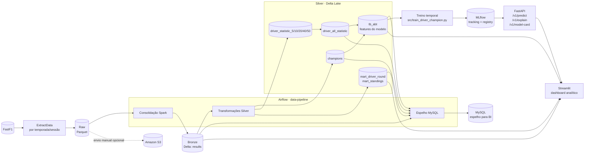

# Lake FastF1

[](https://github.com/rvanguita/lake-fastf1/actions/workflows/tests.yml)

Uma plataforma de dados e machine learning para transformar resultados históricos da Fórmula 1 em um lakehouse confiável, análises interativas e probabilidades transparentes para o campeonato de pilotos.

O Lake FastF1 foi construído como um projeto de engenharia de dados ponta a ponta. Ele coleta dados da [FastF1](https://docs.fastf1.dev/), persiste os arquivos brutos, organiza tabelas Delta em camadas, materializa datasets analíticos, treina um modelo temporalmente seguro e publica os resultados por uma API e um dashboard.

## O que o projeto entrega

- **Pipeline de dados:** ingestão por temporada e sessão, consolidação em Parquet/Delta e transformações Spark SQL.
- **Lakehouse local:** camadas Raw, Bronze e Silver com tabelas de resultados, estatísticas, features de treino e marts analíticos.
- **Modelo preditivo:** estimativa calibrada da probabilidade de cada piloto vencer o campeonato.
- **Transparência:** backtests rolling-origin, baseline de pontos recentes, model card, explicações SHAP e intervalos de dispersão do ensemble.
- **Produto analítico:** dashboard Streamlit com visão geral, evolução do campeonato, comparação entre pilotos/equipes e saúde do modelo.
- **Integrações:** Airflow para orquestração, MLflow para tracking/registry, FastAPI para serving, MySQL para espelho analítico e S3 para arquivamento opcional.

## Arquitetura e fluxo do projeto

O fluxo principal é semanal e é orquestrado pelo DAG `data-pipeline`, agendado para segunda-feira à 00:00 UTC, sem catch-up e com no máximo uma execução ativa.




### Fluxo em seis etapas

1. **Extração:** `src/extract_data.py` consulta sessões Race e Sprint da FastF1 e grava cada resultado como Parquet em `PATH_RAW`.
2. **Bronze:** `src/spark_session.py` consolida os Parquets em uma tabela Delta de resultados históricos.
3. **Silver:** `src/silver_data.py` executa as consultas em `src/queries/` e produz campeões, janelas móveis de estatísticas, a tabela consolidada de features, `tb_abt` e os marts analíticos.
4. **Consumo externo:** a tarefa `sender_mysql` replica Bronze e Silver para MySQL. O envio dos arquivos Raw para S3 é independente, manual e opcional.
5. **Treinamento:** `src/train_driver_champion.py` lê `tb_abt`, exclui a temporada corrente, executa backtests cronológicos, calibra o modelo e registra o artefato e o model card no MLflow.
6. **Serving e análise:** a FastAPI carrega o modelo registrado; o Streamlit combina dados Delta filtrados com previsões, explicações e metadados do modelo.

## Camadas de dados

| Camada | Formato | Responsabilidade | Principais saídas |
|---|---|---|---|
| Raw | Parquet | Preservar os resultados retornados pela FastF1 por sessão | `data/raw/results` |
| Bronze | Delta Lake | Consolidar o histórico e oferecer uma fonte física única para transformações | `data/bronze/results` |
| Silver | Delta Lake | Aplicar regras analíticas, features e contratos de qualidade | `champions`, `driver_*`, `tb_abt`, `mart_*` |
| Espelho | MySQL | Disponibilizar Bronze/Silver para consumidores externos e BI | tabelas do schema configurado |

Os grãos, chaves, domínios e expectativas de qualidade dos marts estão documentados no [contrato de dados analíticos](docs/analytics-data-contract.md).

## Produto analítico

O dashboard Streamlit possui quatro jornadas. Temporada, pilotos em destaque e janela de tendência funcionam como filtros globais.

| Página | Pergunta respondida | Conteúdo |
|---|---|---|
| **Visão geral** | Quem controla o campeonato e o que mudou? | KPIs, ranking, chances do título e resumo editorial |
| **Campeonato** | Como a disputa evoluiu rodada a rodada? | Pontos acumulados, bump chart, matriz de resultados e grid → chegada |
| **Comparador** | Onde estão as diferenças entre pilotos e equipes? | Dumbbells, construtores e duelos entre companheiros |
| **Modelo & dados** | A previsão é confiável e os dados estão atualizados? | Backtests, calibração, importância global, SHAP e saúde dos dados |

As páginas carregam apenas os dados necessários para cada visão. As leituras Delta usam projeção de colunas, filtro por temporada e cache associado à versão da tabela. Quando os marts opcionais não estão materializados, o dashboard recompõe as métricas a partir do Bronze.

### Regras analíticas importantes

- Pontos incluem Race e Sprint; vitórias e pódios consideram a corrida principal.
- DNF, DNS, DNQ, DSQ e NC permanecem categorias explícitas.
- Grid zero representa pit lane e não entra no cálculo de médias de posição.
- Trocas de equipe não duplicam um piloto na classificação da temporada.
- Rodadas sem participação preservam os pontos acumulados anteriores.
- Probabilidades de um mesmo snapshot são normalizadas entre os candidatos e somam 100% dentro da tolerância definida pela API.

## Modelo preditivo

O alvo do modelo é identificar o campeão de pilotos a partir das informações disponíveis em cada data de referência.

- A temporada em andamento nunca entra nos rótulos de treinamento.
- O universo de candidatos contém apenas pilotos que já participaram da temporada analisada.
- O backtest usa validação **rolling-origin**: cada temporada é avaliada somente com dados de temporadas anteriores.
- O estimador combina imputação constante, Random Forest e calibração sigmoide aprendida no último ano concluído.
- O model card registra acerto do campeão, ROC-AUC, Brier score, log loss, baseline e curva de calibração.
- O modelo permanece `experimental` quando não supera o baseline configurado.
- A explicação individual usa SHAP; importância global e contribuições locais são apresentadas separadamente.

Os limites retornados pela API representam a dispersão entre membros do ensemble. Eles não são garantia estatística nem intervalo causal de confiança.

## Tecnologias

| Responsabilidade | Tecnologias |
|---|---|
| Fonte e processamento | FastF1, Pandas, NumPy, PySpark |
| Armazenamento | Parquet, Delta Lake |
| Orquestração e lineage | Apache Airflow |
| Modelagem e explicabilidade | scikit-learn, SHAP |
| Tracking e registry | MLflow |
| API | FastAPI, Uvicorn |
| Produto analítico | Streamlit, Plotly |
| Consumo externo | MySQL, Amazon S3 |
| Ambiente | uv, Docker, Docker Compose |

## Execução local

### Pré-requisitos

- Docker com Docker Compose;
- Python 3.13+ e `uv` para executar os comandos locais;
- Java 17 para Spark/Delta;
- um arquivo `.env` criado a partir de `.env.example`;
- dados Delta materializados para executar o dashboard;
- um servidor MLflow acessível para habilitar previsões.

### Subir os serviços

```bash
cp .env.example .env
docker compose up --build -d
```

O Compose sobe Airflow, FastAPI e Streamlit. MLflow, MySQL e S3 são integrações externas e precisam ser configurados pelas variáveis de ambiente.

| Serviço | Endereço |
|---|---|
| Airflow | <http://localhost:8080> |
| FastAPI | <http://localhost:5002> |
| OpenAPI | <http://localhost:5002/docs> |
| Streamlit | <http://localhost:8501> |

Em containers, `MLFLOW_URI` deve apontar para um endereço acessível pela rede Docker. `localhost` dentro da API aponta para o próprio container da API.

### Executar as etapas manualmente

```bash
uv run python -m src.extract_data
uv run python -m src.spark_session
uv run python -m src.silver_data
uv run python -m src.train_driver_champion
```

O DAG do Airflow executa o caminho de ingestão, Bronze, Silver e MySQL. O comando de treinamento continua separado para permitir reprocessamento e experimentação sem acoplar o treino ao ciclo de ingestão.

### Configuração

| Grupo | Variáveis principais |
|---|---|
| Lake | `PATH_RAW`, `PATH_BRONZE`, `PATH_SILVER`, `PATH_QUERIES` |
| MLflow | `MLFLOW_URI`, `MLFLOW_MODEL_REGISTERED`, `MLFLOW_EXPERIMENT_NAME` |
| Serviços | `AIRFLOW_PORT`, `AIRFLOW_UID`, `API_PORT`, `API_URL`, `STREAMLIT_PORT` |
| MySQL | `MYSQL_HOST`, `MYSQL_PORT`, `MYSQL_ID_TABLE`, `MYSQL_USER`, `MYSQL_PASSWORD` |
| S3 opcional | `AWS_KEY`, `AWS_SECRET_KEY`, `REGION_NAME` |

Consulte o [.env.example](.env.example) para os valores esperados. Os caminhos `TABLE_PATH_*` do Streamlit são definidos no `docker-compose.yml` e representam os mounts somente leitura disponíveis no container.

## API de previsões

| Método | Endpoint | Finalidade |
|---|---|---|
| `GET` | `/health_check` | Verificar disponibilidade do processo |
| `GET` | `/model_info` | Consultar features, classes e importâncias globais |
| `POST` | `/predict` | Contrato legado de probabilidades por classe |
| `POST` | `/v1/predict` | Retornar score, probabilidade e intervalos opcionais |
| `POST` | `/v1/explain` | Retornar contribuições SHAP por observação |
| `GET` | `/v1/model-card` | Expor backtests, calibração, corte de treino e limitações |

Exemplos básicos:

```bash
curl http://localhost:5002/health_check
curl http://localhost:5002/v1/model-card
```

`/v1/predict` recebe uma lista `values` contendo todas as features esperadas pelo modelo e um identificador `id`. O campo `include_intervals` é opcional e, por padrão, vale `true`:

```json
{
  "values": [
    {
      "id": "2026_10_driver_1",
      "prediction_group": "2026_10"
    }
  ],
  "include_intervals": false
}
```

O exemplo acima é apenas estrutural: as demais features devem ser obtidas a partir do schema do modelo publicado em `/model_info` ou `/docs`. Com `include_intervals=false`, a API não calcula os membros do ensemble e omite `lower` e `upper` da resposta.

## Qualidade, testes e performance

O projeto possui três ambientes `uv` independentes: raiz, API e Streamlit.

```bash
uv run pytest
(cd app/api && uv run pytest)
(cd app/streamlit && uv run pytest)
uv run ruff check .
uv run ruff format --check .
```

A suíte cobre ingestão, helpers Spark, envio MySQL/S3, contratos SQL, preparação temporal do modelo, endpoints da API, semântica analítica e contratos dos gráficos.

Para medir o benefício dos filtros sazonais nas leituras Delta:

```bash
uv run python scripts/benchmark_delta_reads.py
```

O benchmark compara leituras completas e filtradas por temporada, informando linhas, bytes materializados, tempo e proporção de I/O. Por padrão, ele sinaliza quando uma temporada ultrapassa 10% do volume da tabela completa.

## Estrutura do repositório

```text
lake-fastf1/
├── app/
│   ├── api/                  # previsão, explicações e model card
│   └── streamlit/            # páginas, dados, semântica e gráficos
├── dags/                     # DAG de ingestão e transformação
├── docs/                     # contratos e documentação complementar
├── scripts/                  # benchmarks e ferramentas de desenvolvimento
├── src/
│   ├── queries/              # SQL da camada Silver
│   ├── extract_data.py       # FastF1 → Raw
│   ├── spark_session.py      # Raw → Bronze
│   ├── silver_data.py        # Bronze → Silver
│   └── train_driver_champion.py
├── tests/                    # testes do pipeline e do treino
├── docker-compose.yml
└── pyproject.toml
```

## Limitações e próximos passos

- O dataset atual é orientado a resultados; telemetria, clima, pneus e tempos de volta ainda não fazem parte dos marts.
- Bronze e Silver são materializados por overwrite; processamento incremental completo ainda não está implementado.
- MLflow e MySQL não são provisionados pelo Compose atual.
- Comparações entre eras precisam considerar mudanças de regulamento, formato e pontuação.
- Próximas evoluções naturais incluem ingestão incremental, observabilidade operacional, novos sinais de corrida e uma demonstração online.

As probabilidades publicadas são estimativas experimentais e não constituem recomendação de aposta.
